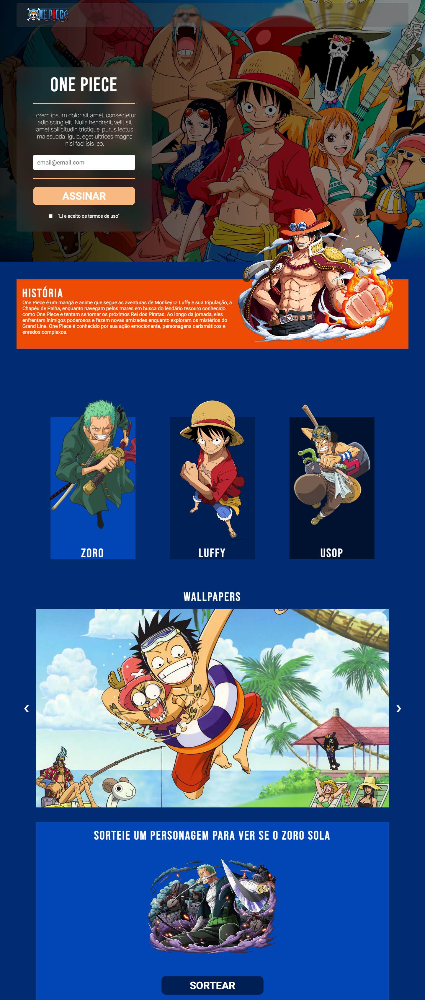
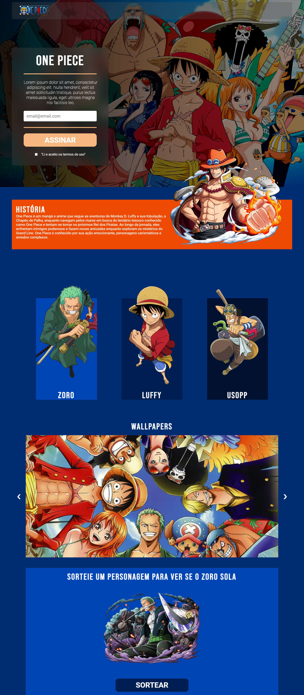
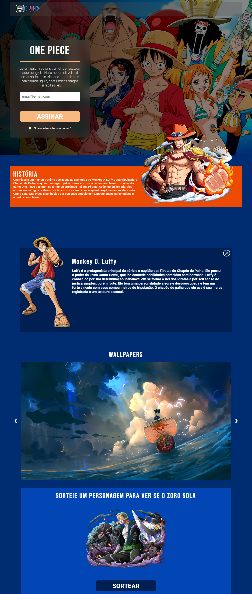
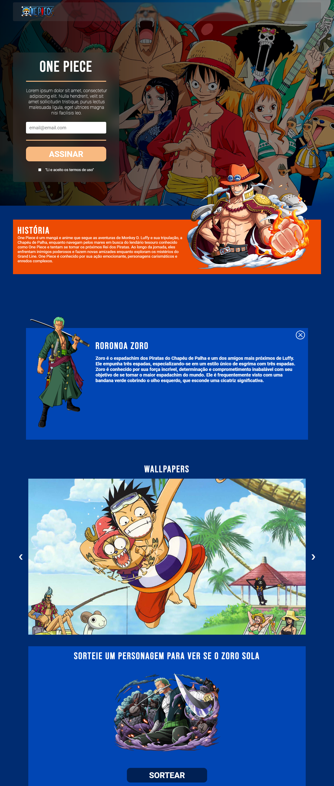
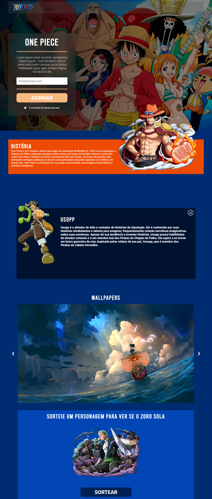

# one-piece-landing-page

## Sumary

- [Overview](#overview)
    - [The Challenge](#the-challenge)
    - [Screenshot](#screenshot)
- [My Process](#my-process)
    - [Built With](#built-with)
    - [What I Learned](#what-i-learned)
- [Updates](#updates)
    - [1st Update](#1st-update)
    - [2nd Update](#2nd-update)

## Overview

### The Challenge

- edit submit form
- See a success message with their email after successfully submitting the form
- See form validation messages if:
  - The field is left empty
  - The email address is not formatted correctly
- View the optimal layout for the interface depending on their device's screen size
- See hover and focus states for all interactive elements on the page
- Description character's area
- Wallpaper slideshow
- Random Challenge Area with oZoro

### Screenshot

    
    
    

## My Process

### Built With

- HTML
- CSS
- Javascript

### What I Learned

- Box-sizing: border-box
- Divider 

- backdrop-filter: blur();
- SliderShow
- Absolute position

## Updates

### 1nd Update
09/13/23

- Header
    - logo area
    - edit area

- History
    - floating character

- Characters (Zoro, Luffy, Usopp) area

- Wallpaper area

- Draw area

    
    

### 2nd Update
09/24/23

- Built the Modals (on click)
    - Roronoa Zoro - Description
    - Luffy D. Monkey - Description
    - Usopp - Description
    - Close modal button

- Wallpaper Slideshow

    
    
    
    

breakpoints:

width: 1088 - 744